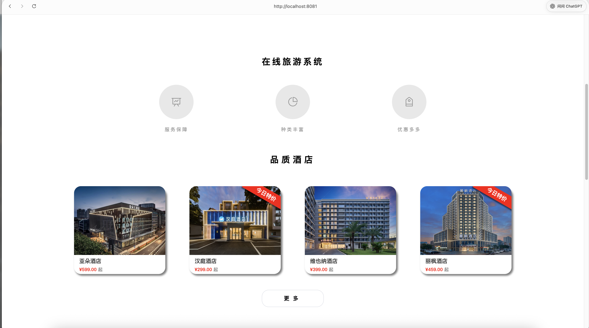
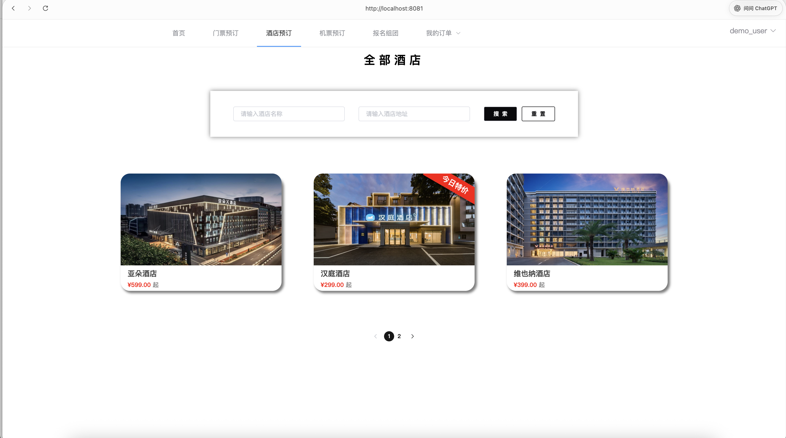
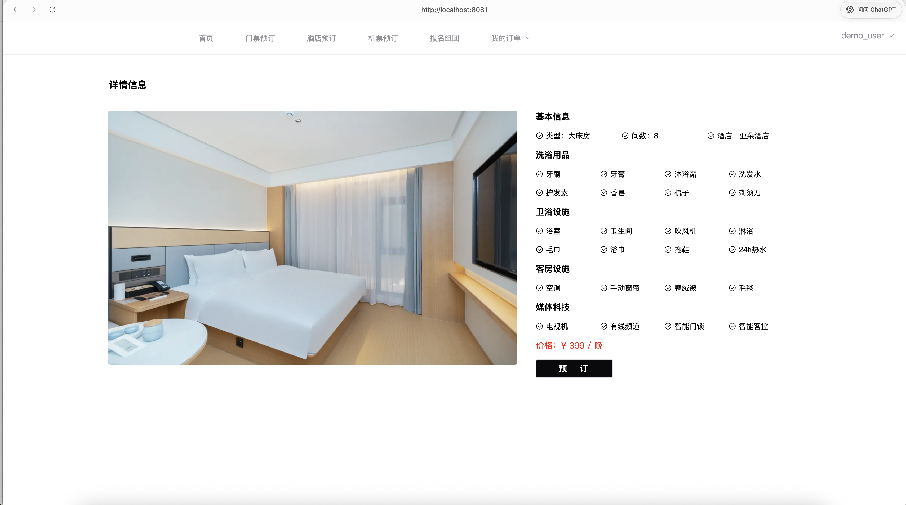
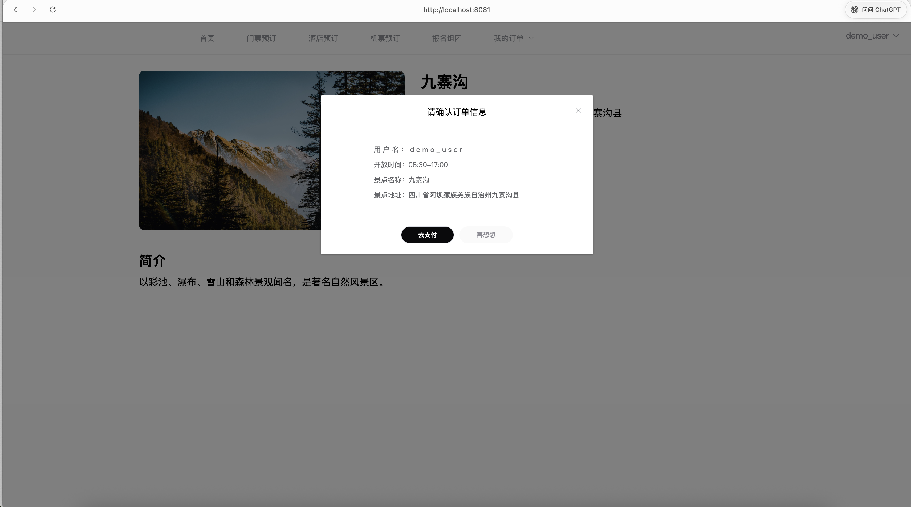
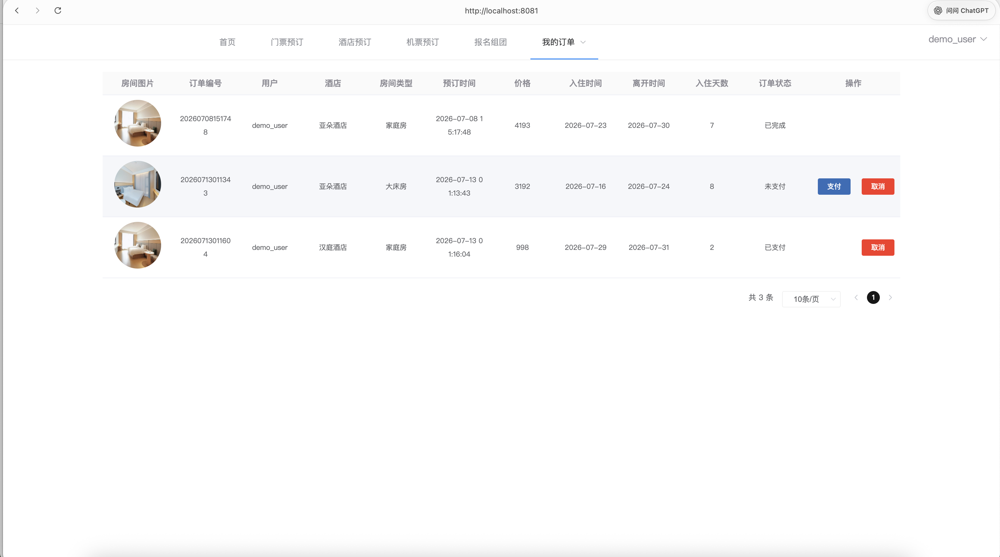
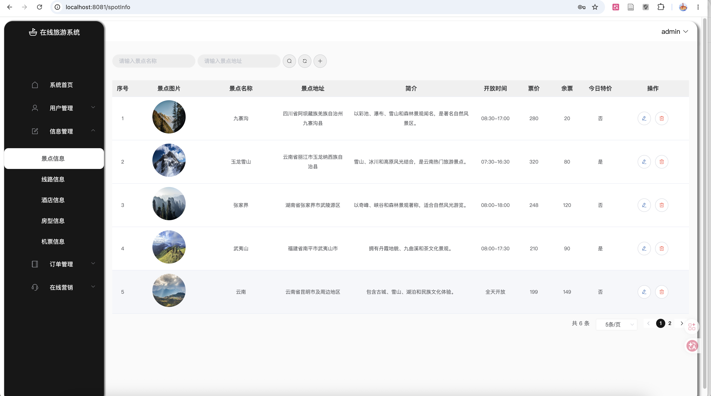
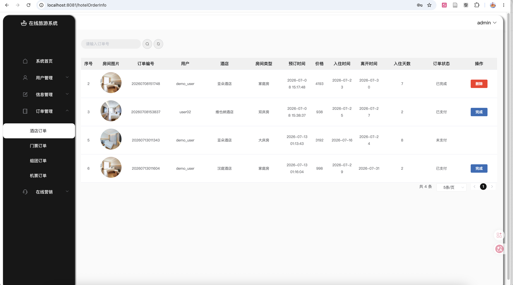

# Online Travel Booking Management System


[Live Demo](https://911413485-spec.github.io/online-travel-booking-system/)

### Demo Login

| Role | Username | Password |
| --- | --- | --- |
| User | `demo_user` | `123` |
| Administrator | `admin` | `123` |

> Select the corresponding role on the login page.
>
> The GitHub Pages demo uses static mock data and local image assets, so it can be explored without starting the Spring Boot backend or MySQL database.
>
> Authentication is simulated in the browser. Data changes made in the online demo are temporary and will be reset after the page is refreshed.


## Overview

This project is a full-stack online travel booking management system built with **Vue 2**, **Spring Boot**, and **MySQL**.

The project supports two running modes:

- **Full-stack local mode**: Vue connects to the Spring Boot REST API and MySQL database.
- **Static demo mode**: GitHub Pages uses mock data and static images stored in the Vue project.

The system includes two main parts:

- **User Portal**: allows users to browse and book hotels, scenic spots, travel routes, and flights.
- **Admin Dashboard**: allows administrators to manage users, hotels, rooms, scenic spots, routes, flights, notices, and orders.

This project was originally developed as an undergraduate capstone project.

---

## Tech Stack

| Layer | Technologies |
| --- | --- |
| Frontend | Vue 2, Vue Router, Element UI, Axios |
| Backend | Spring Boot, Spring MVC, Java |
| Database & Persistence | MySQL, MyBatis |
| Authentication | JWT (full-stack) / Mock login (demo) |
| Build Tools | Maven, Vue CLI |
| Deployment | GitHub Pages, GitHub Actions |

---

---

## Features

The features below describe the full-stack local application. The static GitHub Pages demo simulates selected workflows and does not permanently store uploaded files, account changes, or order changes.

### User Portal

- User registration and login
- User profile management
- Browse hotels, scenic spots, travel routes, and flights
- Book hotels, tickets, routes, and flights
- View, pay, and cancel personal orders
- View system notices

### Admin Dashboard

- Admin login
- User and admin management
- Hotel, room, and room number management
- Scenic spot management
- Travel route management
- Flight management
- Hotel order, ticket order, route order, and flight order management
- Notice management
- Image upload and display

---

## Screenshots

### User Portal

#### Login


#### Home Page



#### Hotel Search and Listing



#### Hotel Details



#### Booking Confirmation



#### User Orders



### Admin Dashboard

#### Scenic Spot Management



#### Order Management



---

## Project Structure

```text
project_travel/
├── README.md                         # Project documentation
├── .gitignore                        # Git ignored files
│
├── .github/
│   └── workflows/
│       └── deploy-pages.yml          # GitHub Pages deployment workflow
│
├── database/
│   └── travel_management_db.sql      # Database schema and sample data
│
├── screenshots/                      # Screenshots used in README
│   ├── preview.png
│   ├── login.png
│   ├── user-home.png
│   ├── hotel-list.png
│   ├── hotel-details.png
│   ├── booking-dialog.png
│   ├── user-orders.png
│   ├── admin-spot-management.png
│   └── admin-order-management.png
│
├── springboot/                       # Backend project
│   ├── src/main/java/com/example/
│   │   ├── common/                   # JWT, interceptors, and response wrapper
│   │   ├── controller/               # Controller layer
│   │   ├── dao/                      # Data access layer
│   │   ├── entity/                   # Entity classes
│   │   ├── exception/                # Exception handling
│   │   └── service/                  # Business logic layer
│   ├── src/main/resources/
│   │   ├── mapper/                   # MyBatis XML mapper files
│   │   └── application-example.yml   # Backend configuration
│   ├── file/                         # Uploaded image resources
│   └── pom.xml                       # Maven configuration
│
└── vue/                              # Frontend project
    ├── public/
    │   ├── demo/                     # Static images used by GitHub Pages demo
    │   └── ...                       # Login images and other static assets
    ├── src/
    │   ├── mock/
    │   │   └── demoApi.js            # Static demo API and mock data
    │   ├── router/                   # Vue Router configuration
    │   ├── utils/                    # Axios request configuration
    │   ├── views/admin/              # Admin dashboard pages
    │   └── views/front/              # User portal pages
    ├── .env.production               # Enables static demo mode in production
    ├── package.json
    └── vue.config.js
```

---

## Local Setup

### Prerequisites

- JDK 8
- Maven
- MySQL
- Node.js and npm
- IntelliJ IDEA or another Java IDE

### 1. Database Setup

Create a MySQL database:

```sql
CREATE DATABASE travel_management_db
DEFAULT CHARACTER SET utf8mb4
COLLATE utf8mb4_unicode_ci;
```

Import the database file:

```bash
mysql -u root -p travel_management_db < database/travel_management_db.sql
```

Copy the example configuration file:

```bash
cp springboot/src/main/resources/application-example.yml \
   springboot/src/main/resources/application.yml
```

Then update the MySQL username and password in `application.yml`.

Example configuration:

```yaml
spring:
  datasource:
    driver-class-name: com.mysql.jdbc.Driver
    username: root
    password: your_mysql_password
    url: jdbc:mysql://localhost:3306/travel_management_db?useUnicode=true&characterEncoding=utf-8&useSSL=false&serverTimezone=GMT%2b8&allowPublicKeyRetrieval=true
```

---

### 2. Start the Backend

Open the project in IntelliJ IDEA and run:

```text
springboot/src/main/java/com/example/SpringbootApplication.java
```

The backend runs at:

```text
http://localhost:8080
```

API prefix:

```text
http://localhost:8080/api
```

---

### 3. Start the Frontend

Go to the frontend directory:

```bash
cd vue
npm install
npm run serve
```

The frontend runs at:

```text
http://localhost:8081
```

The frontend API base URL is configured in:

```text
vue/src/utils/request.js
```

---

## Static Demo Mode

The GitHub Pages deployment runs as a frontend-only demonstration and does not require Spring Boot or MySQL.

Static demo mode is enabled in:

```text
vue/.env.production
```

with the following environment variable:

```env
VUE_APP_DEMO_MODE=true
```

Mock API responses and temporary demo data are defined in:

```text
vue/src/mock/demoApi.js
```

Static images used by the online demo are stored in:

```text
vue/public/demo
```

To test the static demo locally without starting the backend or database:

```bash
cd vue
VUE_APP_DEMO_MODE=true npm run serve
```

Operations such as creating, paying, finishing, or deleting orders are simulated in memory. Changes are reset when the page is refreshed.

---

## Image Resources

Login page images and other frontend static assets are stored in:

```text
vue/public
```

Static images used by the GitHub Pages demo are stored in:

```text
vue/public/demo
```

Images uploaded through the local full-stack application, including user avatars, hotels, rooms, scenic spots, and travel routes, are stored in:

```text
springboot/file
```

In local full-stack mode, uploaded images are served through the Spring Boot file API. In static demo mode, images are loaded directly from the Vue public directory.

---

## Project Highlights

- Built user and admin modules for hotel, scenic spot, travel route, flight, and order management.
- Integrated the Vue frontend with Spring Boot REST APIs and MyBatis-based MySQL persistence.
- Added a frontend-only GitHub Pages demo using mock APIs and static image assets while preserving the full-stack local mode.